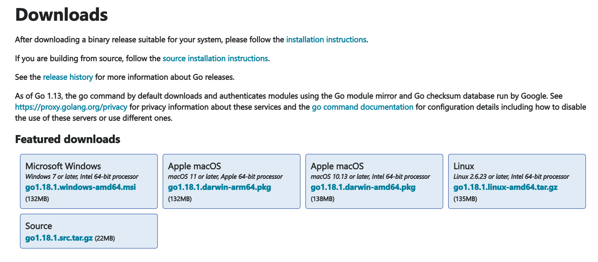
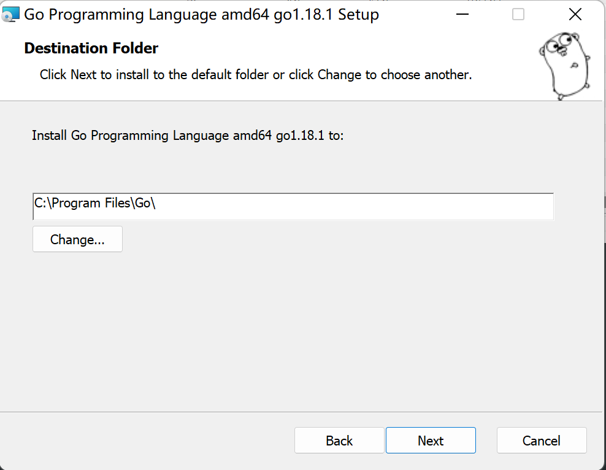
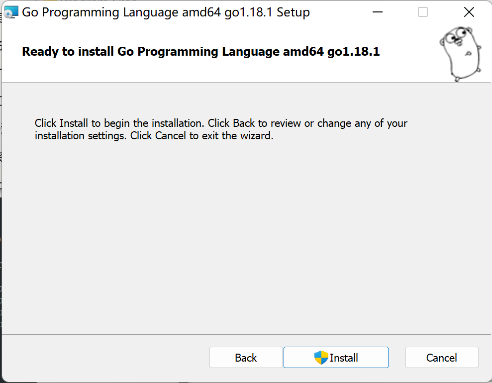
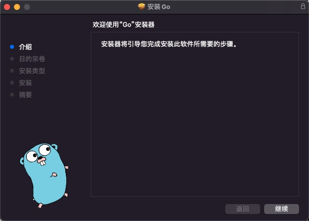
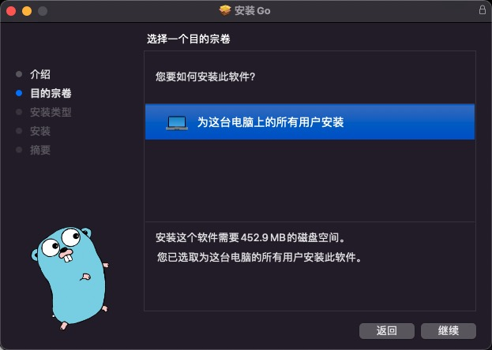
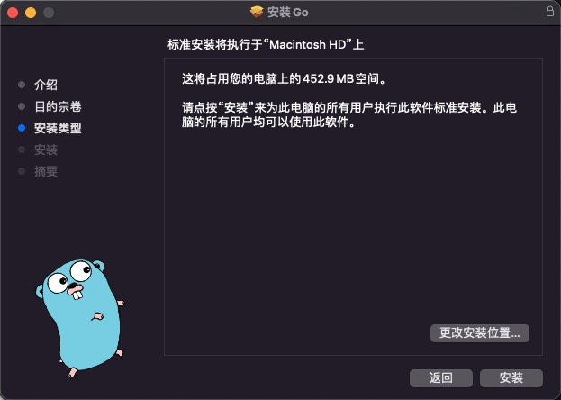
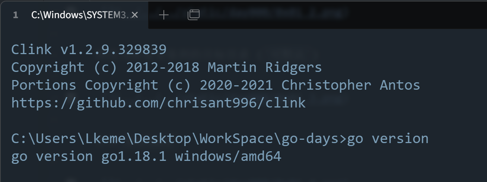

## 0x01 各平台安装Go

### 下载地址

| 名称    | 站点                                                           |
|-------|--------------------------------------------------------------|
| 官网    | [https://go.dev/dl/](https://go.dev/dl/)                     |
| 官方镜像站 | [https://golang.google.cn/dl/](https://golang.google.cn/dl/) |

> 选择对应系统与架构下载，Windows(msi)、Macos(pkg)、Linux(tar.gz)



> 以下版本都以文档时的 `最新版本_amd64` 操作

### Windows 平台

点击`*.msi`安装包，一直`Next`


修改为想要安装到的目标目录 (`可默认`)



点击`Install`



等待安装完成即可，`Finish`


### Macos 平台

与Windows相同，Macos也是可执行安装包，点击`*.pkg`安装包  







一直`继续`等待安装完成即可，默认会安装到`/usr/local/go`目录


### Linux 平台

> 如果不是编码平台，不推荐安装，推荐从编码平台跨平台编译二进制执行文件

```bash
# 下载
$ wget https://dl.google.com/go/go{版本}.linux-{处理器架构}.tar.gz
# 解压到 /usr/local
$ tar -zxvf go{版本}.linux-{处理器架构}.tar.gz -C /usr/local
```

```bash
# 配置环境变量
$ vim ~/.bash_profile

# 添加以下两行到文件最后
export GOROOT=/usr/local/go
export PATH=$PATH:$GOROOT/bin

# 重新加载环境变量
$ source ~/.bash_profile
```

> 如果提示权限问题，用`sudo`提升为root权限后操作  


### 安装完成检测

```bash
$ go version
```




## 链接

- [目录](../../../README.md)
- 上一节：[扉页](../0x00%20扉页/)
- 下一节：[安装编码环境](../0x02%20安装编码环境/)


