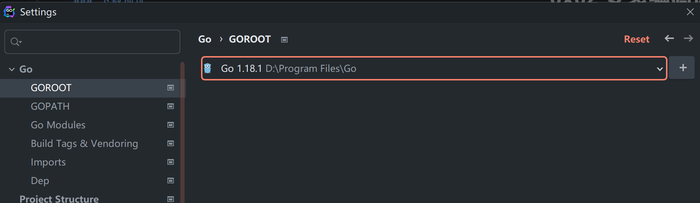
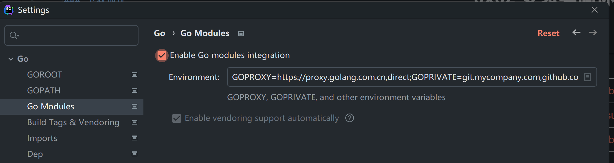
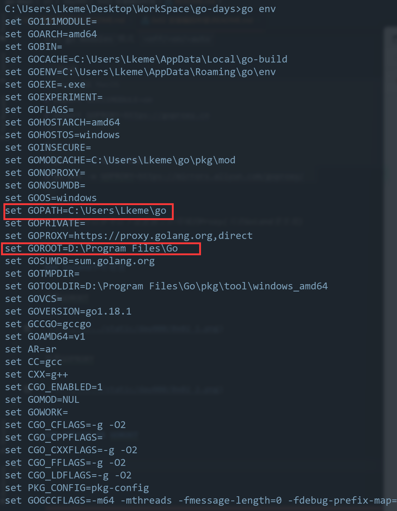

## 0x02 安装编码环境

### 下载地址

| 名称      | 站点                                                                               |
|---------|----------------------------------------------------------------------------------|
| Goland  | [https://www.jetbrains.com/zh-cn/go/](https://www.jetbrains.com/zh-cn/go/)       |
| VS Code | [https://code.visualstudio.com/Download](https://code.visualstudio.com/Download) |
| Sublime | [https://www.sublimetext.com/](https://www.sublimetext.com/)                     |


### GoProxy 设置

新版Golang推荐使用`go modules`模式，由于部分地区网络问题，可能会导致模块拉取过慢或者拉取失败。  

如果遇到这类问题，可以通过设置`GoProxy`来尝试解决。  

| 名称  | 站点                                                                         |
|-----|----------------------------------------------------------------------------|
| 阿里云 | [https://mirrors.aliyun.com/goproxy/](https://mirrors.aliyun.com/goproxy/) |
| 七牛  | [https://goproxy.cn/](https://goproxy.cn/)                                 |
| 官方  | [https://goproxy.io/zh/](https://goproxy.io/zh/)                           |

启用`go modules`模式 `=off/=on/=auto`

```bash
# Linux && MacOS
$ export GO111MODULE=on
$ export GOPROXY=https://goproxy.cn

# Windows
$ go env -w GO111MODULE=on
$ go env -w GOPROXY=https://mirrors.aliyun.com/goproxy/   
```

> Goland可以参考以下设置独立作用域的Proxy(只在Goland里生效)


### Goland少许设置

设置GOROOT



设置GOPROXY




### GOPATH && GOROOT

`GOENV`里比较关键的两个环境变量，可以稍微了解一下



> `GOROOT`就是我们安装Go程序的文件夹，`Goland`等IDE可以获取  
 

> `GOPATH`是默认生成的工程目录 (可以自己定义，也可以默认)  
 
| 平台	     | 默认值               | 	默认映射路径            |
|---------|-------------------|--------------------|
| Windows | 	%USERPROFILE%/go | 	C:\Users\{用户名}\go |
| Unix    | 	  $HOME/go	      | /home/{用户名}/go     |

> 编译或者在拉取使用模块的时，会使用`GOPATH`下的目录，如果自定义后不存在目录，请新建  

| 目录	 | 描述           | 
|-----|--------------|
| bin | 	放置编译后的可执行程序 | 
| pkg | 	  放置mod依赖包	 |
| src | 放置项目源码       |


## 链接

- [目录](../../../README.md)
- 上一节：[搭建开发环境](../0x01%20搭建开发环境/)
- 下一节：[新建一个项目](../../day001/0x00%20新建一个项目/)


