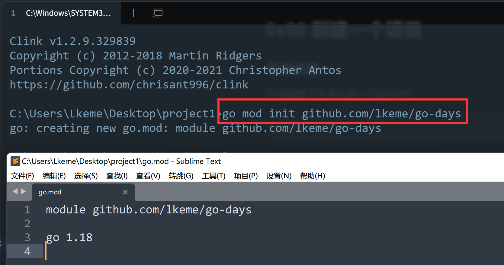
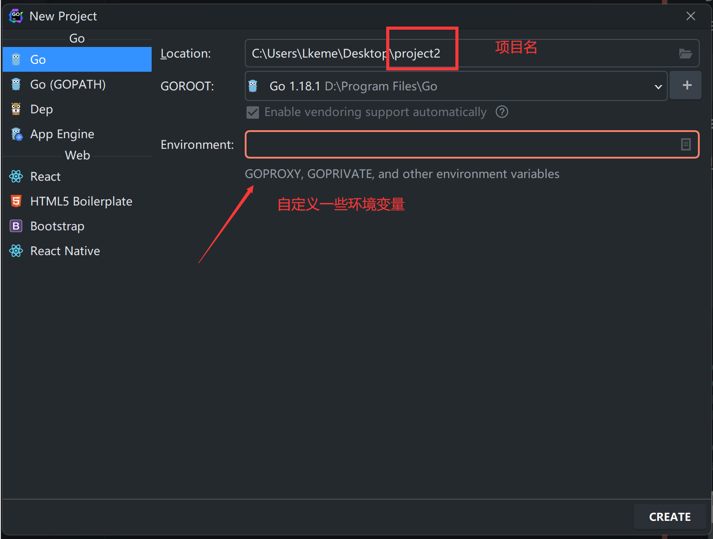

## 0x00 新建一个项目

### 手动创建一

手动创建文件夹以及一个go文件

```
Project/main.go
```


### 手动创建(使用go mod)

创建一个文件夹后并使用`go mod`初始化项目，会自动生成一个`go.mod`文件

```bash
$ go mod init {模块名称}
# 例子
$ go mod init hello-world
# 如果本身有线上项目仓库的，推荐以下命名
$ go mod init github.com/lkeme/go-days
```




### Goland创建(使用go mod)

Goland创建项目也是默认使用的`go mod`模式，会自动生成一个`go.mod`文件



```mod
module project2
```

> `go mod`里的module 是以`项目名`命名


### go.mod 小解

- 项目使用`go.mod`管理后，在`go get`、`go build`、`go mod`等操作时，会修改和维护当前文件  

- 同时也会自动维护一个`go.sum`，用于记录每个依赖包的哈希值，只用稍稍了解，此文件会自动维护 

- 非特殊情况，一个项目只存在一个`go.mod`在根目录即可，子目录不需要init

> 项目构建时，会校验本地依赖包与`go.sum`里对应依赖包哈希值的一致性，否则会拒绝构建 


## 链接

- [目录](../../../README.md)
- 上一节：[安装编码环境](../../day000/0x02%20安装编码环境)
- 下一节：[向世界问好](../0x01%20向世界问好)


