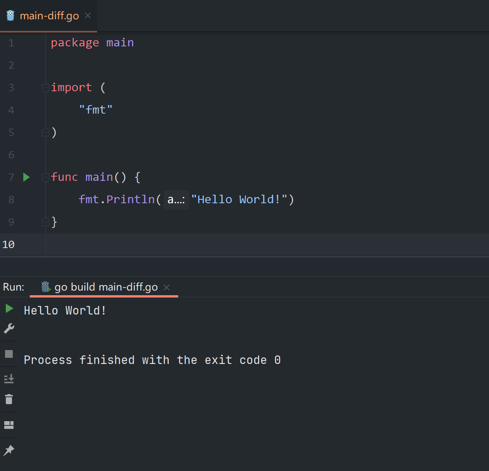

## 0x00 向世界问好



### 程序入口

```go
package main

func main() {
	
}
```


- go包名以 `package *` 声明

```go
package main
```

- go函数以 `func *(){}` 定义

```go
package main

func main(){
	
}
```

> 当`package`和`func`都为`main`时才是正确的程序入口  


- 文件名不用与包名保持一致(`main-diff.go`)
```go
package main
```


### import导入包

单行导入(`只有单个包的时候推荐`)

```go
package main

import "包1"
import "包2"
```

如果多个包，使用多行导入(`默认推荐`)

```go
package main

import  (
	"包2"
	"包1"
)
```
