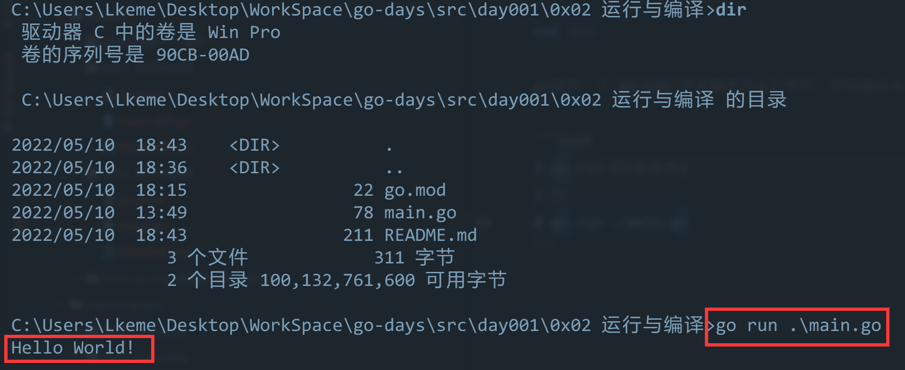
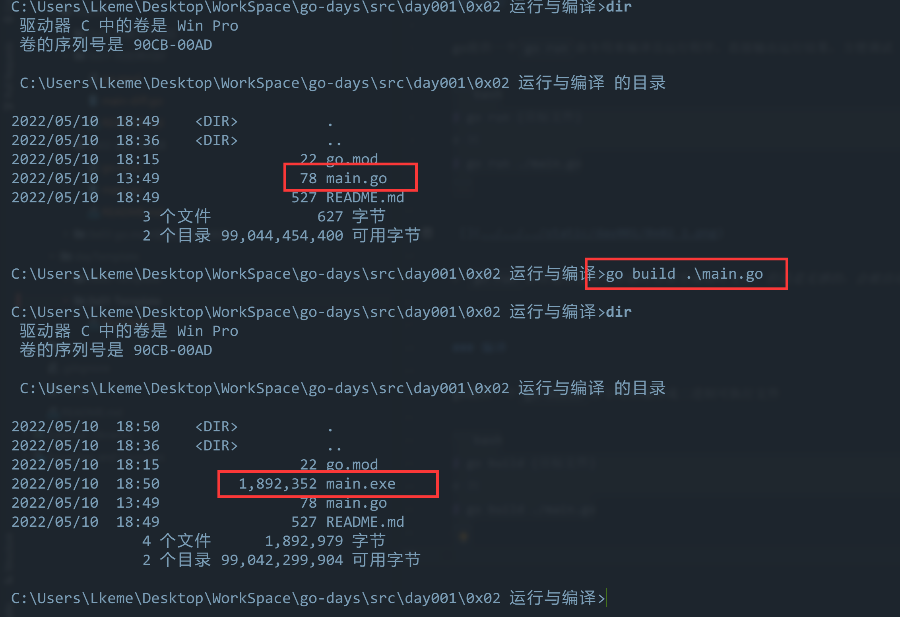
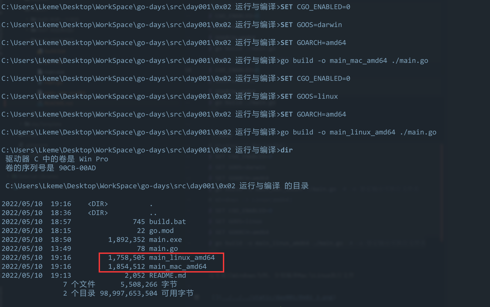

## 0x01 运行与编译

### 运行

go提供一个`go run`命令用来编译且运行程序，直接输出运行结果，方便调试  

```bash
$ go run {目标文件}
# 例
$ go run ./main.go
```



> `go run`会在运行过程中在临时目录生成临时文件，但是是无感的，会被自动清理掉

 
### 编译

go提供一个`go build`命令用来编译成二进制可执行文件

```bash
$ go build {目标文件}
# 例
$ go build ./main.go
```



> 如果编译过程无措，会在执行命令目录下生成可执行文件，Windows下为exe


### 跨平台交叉编译

默认执行编译的时候，都是根据当前编码系统自动编译的  
如果我们需要在Windows平台编码，需要放到Linux下去运行，则使用交叉编译 

```bash
# Mac -> Linux(amd64)
$ CGO_ENABLED=0 
$ GOOS=linux 
$ GOARCH=amd64 
$ go build ./main.go
# Mac -> Windows(amd64)
$ CGO_ENABLED=0 
$ GOOS=windows 
$ GOARCH=amd64 
$ go build main.go
```

```bash
# Linux -> Mac(amd64)
$ CGO_ENABLED=0
$ GOOS=darwin
$ GOARCH=amd64
$ go build ./main.go
# Linux -> Windows(amd64)
$ CGO_ENABLED=0
$ GOOS=windows
$ GOARCH=amd64
$ go build ./main.go
```

```bash
# Windows -> Mac(amd64)
$ SET CGO_ENABLED=0
$ SET GOOS=darwin
$ SET GOARCH=amd64
$ go build -o main_mac_amd64 ./main.go  # -o 指定输出可执行文件名
# Windows -> Linux(amd64)
$ SET CGO_ENABLED=0
$ SET GOOS=linux
$ SET GOARCH=amd64
$ go build -o main_linux_amd64 ./main.go  # -o 指定输出可执行文件名
```

这里就以Windows为例，分别编译Mac与Linux执行文件  




### 额外

> 如果文件名`main.go`、包名`package main`、方法名`func main()`，则可省略文件名


```bash
$ go run 
$ go build
# 满足上述条件，则等于
$ go run main.go
$ go build main.go
```


可以参考Windows平台编译[小脚本build.bat](build.bat)


