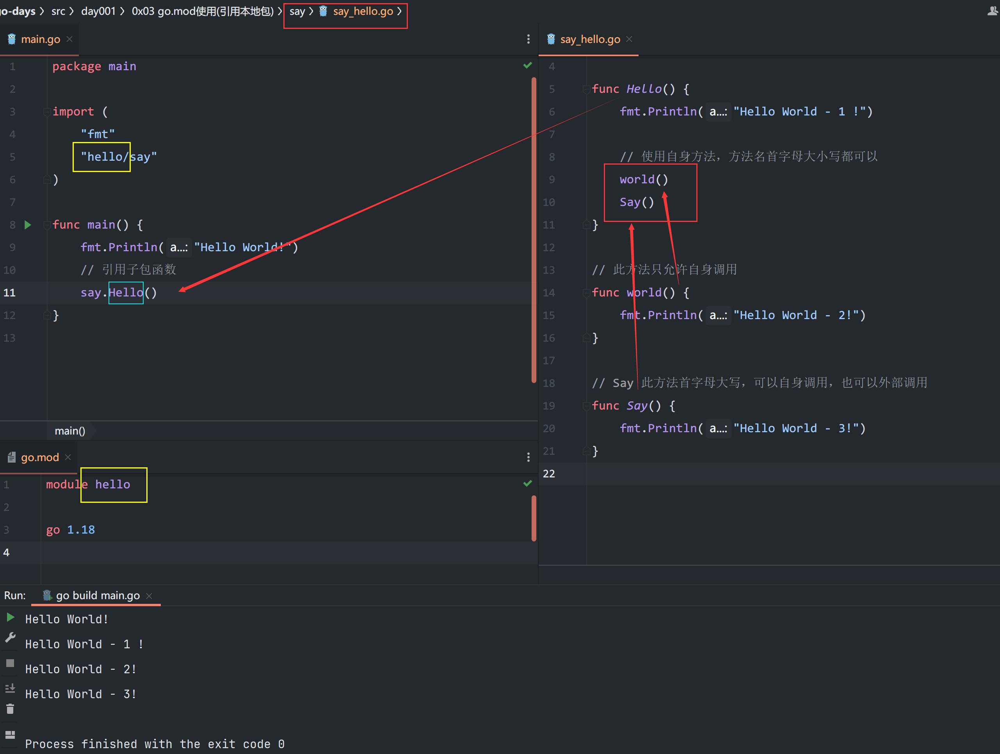

## 0x03 go.mod使用(引用本地依赖)

`go mod`模式在golang1.16之后自动开启  
使用`go mod`来管理依赖的其中一项作用就是方便导入本地包  



- 引入本地包是以`go.mod`的`module`为根目录
- 本地包的函数要让其他包引用使用的话，函数名需要以首字母大写形式
- 函数小写只能子包自己使用
- 非业务要求，不要自己调用自己，不做跳出条件的话，会无限递归，死循环

```go
package main

import "fmt"

func Hello() {
	fmt.Println("Hello World!")
	// 自己调用自己 , 会陷入递归死循环，如果有业务要求，请一定要做跳出条件
	Hello()
}

func main()  {
    Hello()
}
```


## 链接

- [目录](../../../README.md)
- 上一节：[运行与编译](../0x03%20go.mod使用(引用本地依赖))
- 下一节：


