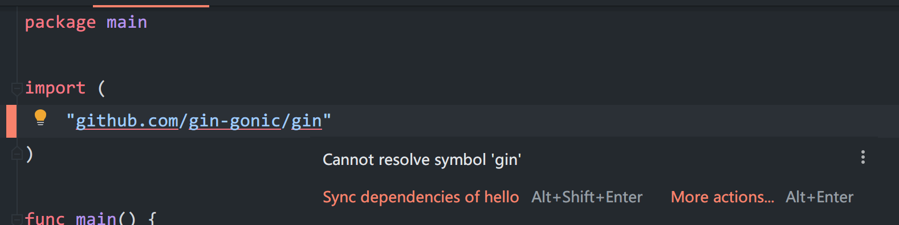
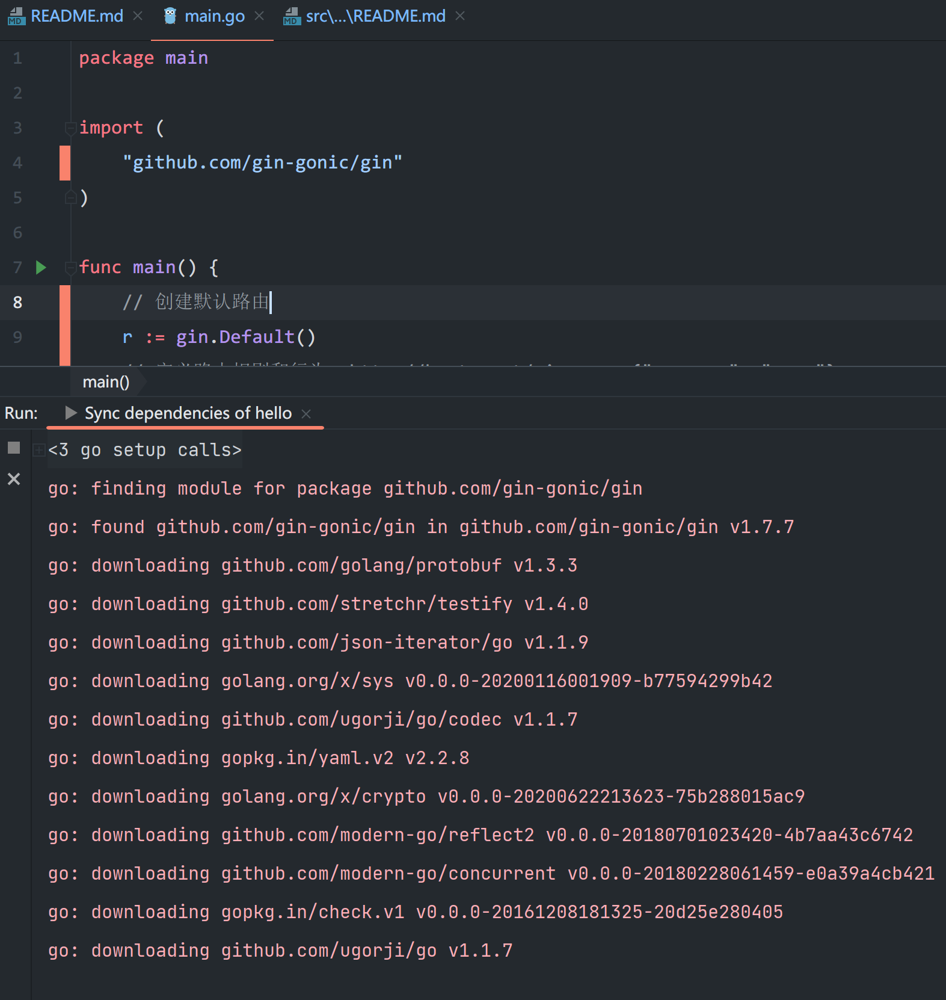
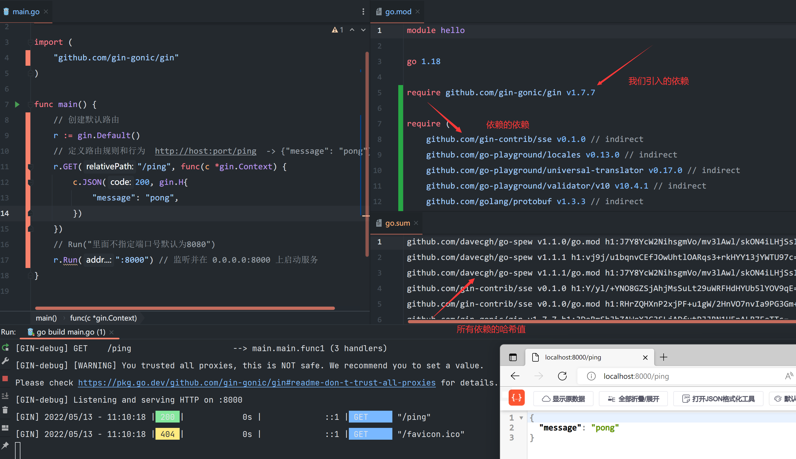

## 0x03 go.mod使用(引用线上依赖)


### 自动同步包

使用`go mod`模式管理依赖，在`go run`或者`go build`时会自动拉取依赖包
```bash
# tidy 会检测该文件夹目录下所有引入的依赖，并写入go.mod
$ go mod tidy

$ go run ./main.go
$ go build ./main.go
```


### 手动同步包

```bash
# tidy 会检测该文件夹目录下所有引入的依赖，并写入go.mod
$ go mod tidy

# 下载go.mod中的依赖下载至本地
$ go mod download
```

> 当然，如果你已经了解`go.mod`格式，也可以手动添加至文件


### Goland同步包

如果需要在编码过程中拉取包，可以点击`Sync dependencies...`同步

- 可以将鼠标移动至包名，自动浮现出操作框
- 或者点击包名，按`Alt+Enter`，弹出操作框




### 结果

以Goland操作，同步包与运行



以Golang经典的Web框架`Gin`为例，简单的引入使用  



> 请注意，如果拉取包过程过慢或者失败，请一定要设置`GOPROXY`

## 链接

- [目录](../../../README.md)
- 上一节：[运行与编译](../0x03%20go.mod使用(引用本地依赖))
- 下一节：[变量与常量的定义](../../day002/0x00%20变量与常量的定义)


